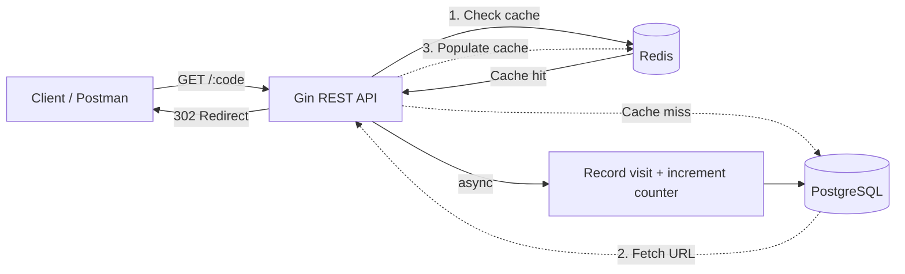

<div align="center">


<a href="https://github.com/golang/go">
  
</a>
<a href="https://gin-gonic.com/">
  
</a>
<a href="https://www.postgresql.org/">
  
</a>
<a href="https://redis.io/">
  
</a>
<a href="https://www.docker.com/">
  
</a>

<br/>


</div>

---

## 📦 About

**ShortLink** is a backend REST API that shortens long URLs and tracks click analytics. The core focus of this project is **caching and performance** using Redis:

- Redirects use a **cache-aside pattern**: the short code to URL mapping is checked in Redis first, falling back to PostgreSQL only on a cache miss, then populating the cache for subsequent requests.
- **Rate limiting** is implemented with Redis using a fixed-window counter, protecting both the redirect endpoint and link creation from abuse.
- Click tracking is recorded asynchronously so it never slows down the redirect response.

This project is built as a backend portfolio piece to demonstrate:

- ✅ Cache-aside pattern with Redis (cache hit/miss handling)
- ✅ Redis-based rate limiting (fixed-window counter with TTL)
- ✅ JWT authentication
- ✅ Click analytics with async recording
- ✅ Dockerized setup (app + PostgreSQL + Redis in one command)

---

## 🏗️ Architecture



---

## 🚀 Tech Stack

| Component | Technology |
|---|---|
| Language | Go 1.22 |
| Web Framework | Gin |
| Database | PostgreSQL |
| Cache / Rate Limiter | Redis |
| Auth | JWT (golang-jwt) |
| Password Hashing | bcrypt |
| Containerization | Docker & Docker Compose |

---

## 📁 Project Structure

```
shortlink/
├── main.go                    # entry point
├── config/database.go         # PostgreSQL + Redis connection, auto-migration
├── models/models.go            # structs & request payloads
├── middleware/auth.go          # JWT auth & Redis-based rate limiter
├── handlers/
│   ├── auth_handler.go         # register & login
│   └── link_handler.go         # create link, redirect (cache-aside), stats, my-links
├── routes/routes.go            # route definitions
├── postman/                     # Postman collection for testing
├── Dockerfile
├── docker-compose.yml
└── README.md
```

> **Note on database schema**: tables are created automatically at startup via `RunMigrations()` in `config/database.go` (using `CREATE TABLE IF NOT EXISTS`), so no manual setup step is needed.

---

## ⚙️ Getting Started

### Option 1 - Run with Docker (recommended)

This spins up the API, PostgreSQL, and Redis with a single command.

```bash
git clone https://github.com/0xrayn/shortlink.git
cd shortlink
docker-compose up --build
```

The API will be available at `http://localhost:8080`.

### Option 2 - Run locally

Requires Go 1.22+, a running PostgreSQL instance, and a running Redis instance.

```bash
git clone https://github.com/0xrayn/shortlink.git
cd shortlink

cp .env.example .env
# Edit .env to match your local PostgreSQL and Redis configuration

go mod tidy
go run main.go
```

---

## 📖 API Documentation

### Authentication

| Method | Endpoint | Description | Auth |
|---|---|---|---|
| POST | `/auth/register` | Register a new user | - |
| POST | `/auth/login` | Login and get JWT token | - |

**Register**
```json
POST /auth/register
{
  "email": "user@example.com",
  "password": "secret123"
}
```

**Login**
```json
POST /auth/login
{
  "email": "user@example.com",
  "password": "secret123"
}
```

### Links

| Method | Endpoint | Description | Auth | Rate Limit |
|---|---|---|---|---|
| POST | `/shorten` | Create a short link | Required | 10 req/min per IP |
| GET | `/:code` | Redirect to the original URL | - | 60 req/min per IP |
| GET | `/:code/stats` | Get click stats for a link | - | - |
| GET | `/my-links` | List links created by the logged-in user | Required | - |

**Create Short Link**
```json
POST /shorten
Authorization: Bearer <token>

{
  "url": "https://example.com/some/very/long/path"
}
```

Optionally provide a custom alias:
```json
{
  "url": "https://docs.claude.com",
  "code": "claude-docs"
}
```

Response:
```json
{
  "id": 1,
  "code": "aB3xY9",
  "short_url": "http://localhost:8080/aB3xY9",
  "original_url": "https://example.com/some/very/long/path",
  "created_at": "2026-06-14T10:00:00Z"
}
```

**Redirect**
```
GET /aB3xY9
```
Returns `302 Found` with `Location` header set to the original URL. The first request is a cache miss (reads from PostgreSQL and populates Redis); subsequent requests are served from Redis until the cache entry expires (1 hour TTL).

**Get Link Stats**
```
GET /aB3xY9/stats
```
```json
{
  "code": "aB3xY9",
  "original_url": "https://example.com/some/very/long/path",
  "click_count": 5,
  "created_at": "2026-06-14T10:00:00Z",
  "recent_visits": [
    { "visited_at": "2026-06-14T10:05:00Z", "ip_address": "127.0.0.1", "user_agent": "PostmanRuntime/7.36.0" }
  ]
}
```

**Get My Links**
```
GET /my-links?page=1&limit=10
Authorization: Bearer <token>
```
```json
{
  "data": [ ... ],
  "pagination": { "page": 1, "limit": 10, "total": 3 }
}
```

### Health

| Method | Endpoint | Description |
|---|---|---|
| GET | `/health` | Health check |

---

## 🔒 Caching Strategy - The Core of This Project

The most important part of this codebase is `RedirectLink` in `handlers/link_handler.go`. Every redirect follows the **cache-aside pattern**:

1. Check Redis for `link:<code>`.
2. **Cache hit** -> use the cached URL directly, skip the database entirely.
3. **Cache miss** -> query PostgreSQL for the original URL, then store it in Redis with a TTL (1 hour) for future requests.
4. Record the visit (insert into `link_visits`, increment `click_count`) **asynchronously in a goroutine**, so the redirect response is never delayed by write operations.

### Rate Limiting

`middleware.RateLimit(limit, window)` implements a **fixed-window counter** using Redis:

- Each `(route, IP)` pair gets a Redis key with an incrementing counter and a TTL equal to the window duration.
- If the counter exceeds the limit before the TTL expires, the request is rejected with `429 Too Many Requests` and a `retry_after` field (seconds until the window resets).
- `/shorten` is limited to 10 requests/minute per IP (prevent spam link creation).
- `/:code` (redirect) is limited to 60 requests/minute per IP (prevent abuse while allowing normal traffic).

---

## 🧪 Testing with Postman

A ready-to-use Postman collection is included at `postman/ShortLink_API.postman_collection.json`, covering:

- Register & login (with automatic token extraction)
- Create short link (random code and custom alias)
- Redirect (cache miss -> cache hit flow)
- Click stats verification
- Pagination on `/my-links`
- 404 for non-existent codes
- Rate limit behavior (`429` after exceeding the limit)

**How to run:**

1. Open Postman -> **Import** -> select `postman/ShortLink_API.postman_collection.json`
2. Make sure the API is running (`docker-compose up` or `go run main.go`)
3. Click the collection -> **Run** -> **Run ShortLink API**

All requests include `pm.test()` assertions, so the runner gives a pass/fail summary automatically - no manual checking needed.

---

## 📸 Demo

Screenshots of the API tested via Postman:

**Create short link**


**Redirect with cache**


**Link stats**


**Rate limit response**


---

## 🗺️ Roadmap

- [x] JWT authentication
- [x] Cache-aside pattern with Redis
- [x] Redis-based rate limiting
- [x] Click analytics with async recording
- [x] Pagination
- [x] Dockerized setup
- [x] Postman collection with automated tests
- [ ] Deploy to Railway/Render

---

<div align="center">

</div>
